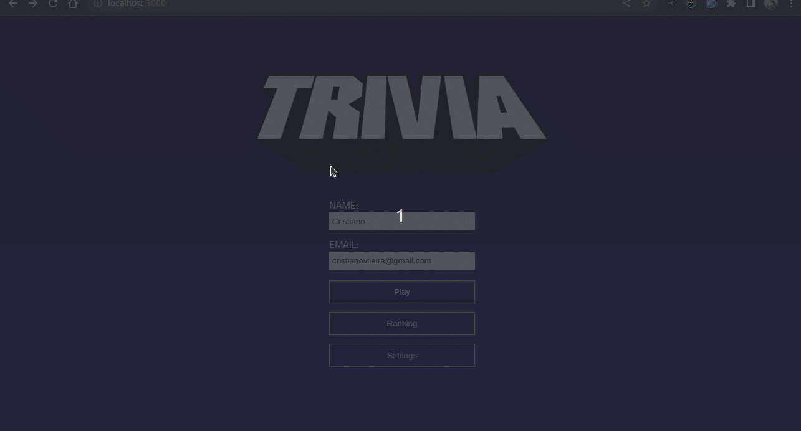

<h1 align="center">
Projeto Jogo de Trivia!
</h1>



<!-- 
## :books: Contexto
Esse Projeto se baseia num jogo de RPG de mesa (Dungeons and Dragons) e teve como objetivo, consolidar os conhecimentos sobre POO, Typescript e SOLID aprendidos ao final do modulo de POO na [Trybe](https://app.betrybe.com/).  -->

## :books: Contexto
Esse Projeto foi feito em grupo e simula um jogo de Trivia onde os jogadores podem se aventurar dando o seu melhor respondendo as perguntas e tentando ficar no topo do ranking. O projeto tentou simular um ambiente de desenvolvimento aonde cada um do grupo tinha a sua responsabilidade, utilizando o metodo Kanban conseguimos evoluir de uma forma super rapida.

## :man_technologist: Tecnologias, bibliotecas e arquiteturas usadas
  * __React__
  * __React Router Dom__
  * __React Testing Library__
  * __Redux__
  * __Redux Thunk__
  * __Jest__

# Instruções da aplicação
### Instalar dependências
```
cd Game-Trivia
npm install
```

### Iniciar Projeto
```
npm start
```

### Rodar Testes
```
npm test
```


<!-- Olá, Tryber!
Esse é apenas um arquivo inicial para o README do seu projeto.
É essencial que você preencha esse documento por conta própria, ok?
Não deixe de usar nossas dicas de escrita de README de projetos, e deixe sua criatividade brilhar!
⚠️ IMPORTANTE: você precisa deixar nítido:
- quais arquivos/pastas foram desenvolvidos por você; 
- quais arquivos/pastas foram desenvolvidos por outra pessoa estudante;
- quais arquivos/pastas foram desenvolvidos pela Trybe.
-->
